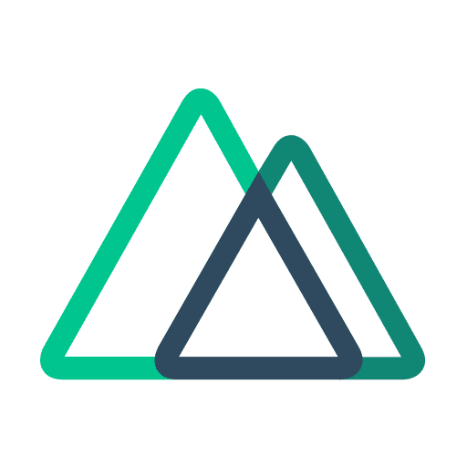

# 👋 Hi Stranger

### 
Full-time frontend freelance developer 👨‍💻 working remotely since 2021 🚀

- 🔭 I’m currently working on Open Source
- 🌱 I’m currently learning new tools in Frontend
- 👀 I’m interested in finding real life problems and their suitable solutions
- 💞️ I’m looking to collaborate with the best communities, finding problems and their suitable solutions
- 💬 Ask me about anything related to Frontend
- 📫 How to reach me: [@iigulzaib](https://twitter.com/iigulzaib) on Twitter
- ⚡ Fun fact: I use 50+ browser tabs while working on a single project 😀  
 

## My Skill Set  

### Frontend

<!-- Languages and Framworks -->

 
<!-- JavaScript -->

### Backend  

  

### DevOps  

  

<!-- Graphics Designing -->
### Grahics Designing

 

## Connect with me  

   

## Github Stats  

  
