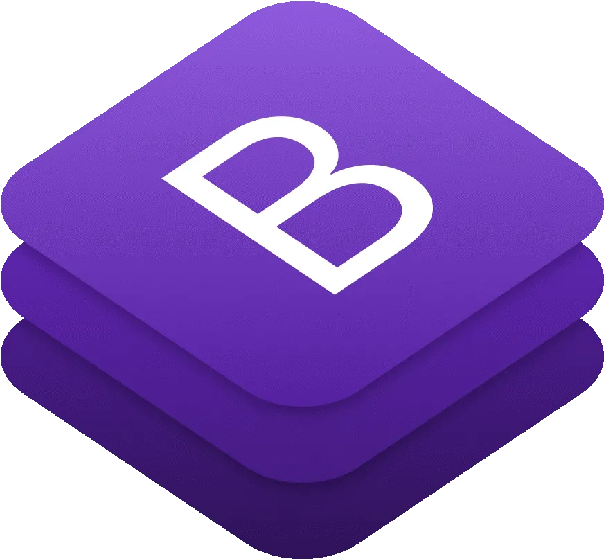
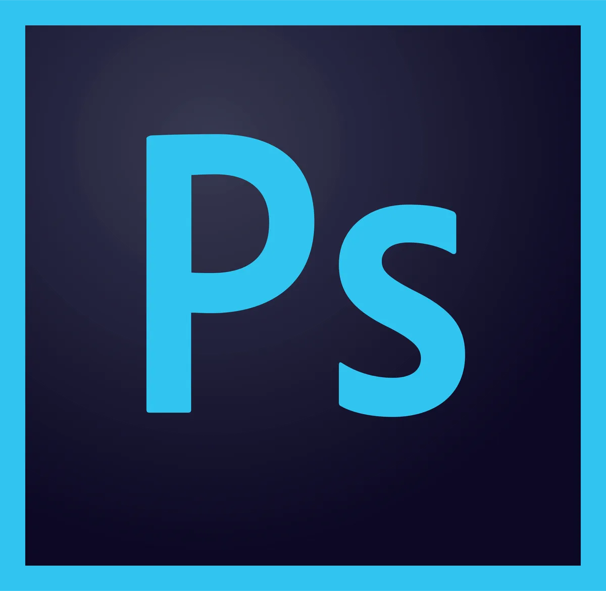

# 👋 Hi Stranger

### 
Full-time frontend freelance developer 👨‍💻 working remotely since 2021 🚀

- 🔭 I’m currently working on Open Source
- 🌱 I’m currently learning new tools in Frontend
- 👀 I’m interested in finding real life problems and their suitable solutions
- 💞️ I’m looking to collaborate with the best communities, finding problems and their suitable solutions
- 💬 Ask me about anything related to Frontend
- 📫 How to reach me: [@iigulzaib](https://twitter.com/iigulzaib) on Twitter
- ⚡ Fun fact: I use 50+ browser tabs while working on a single project 😀  
 

## My Skill Set  

### Frontend

<!-- Languages and Framworks -->

<!-- JavaScript -->

<!-- Graphics Designing -->

### Grahics Designing

<!-- Others -->

<!---
imgul/imgul is a ✨ special ✨ repository because its `README.md` (this file) appears on your GitHub profile.
You can click the Preview link to take a look at your changes.
--->
